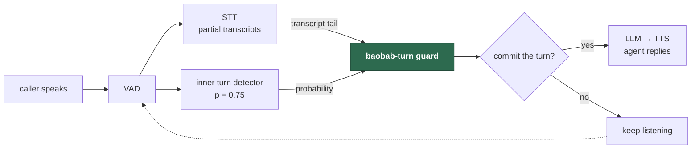
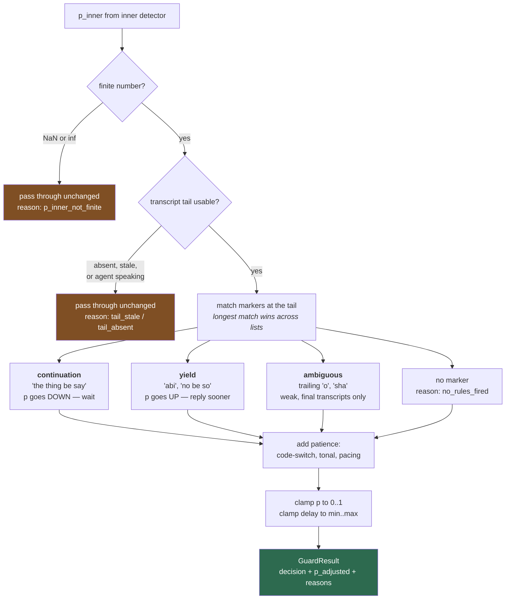
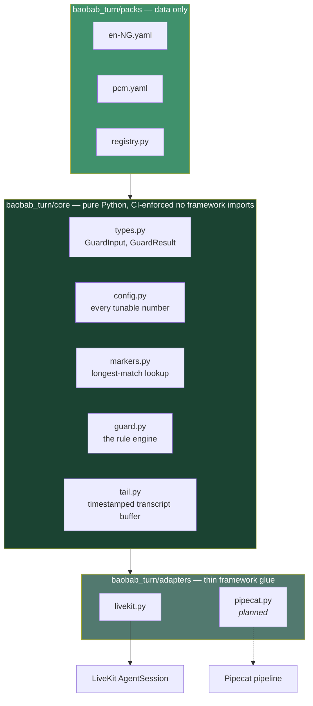
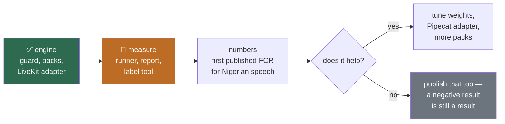

# baobab-turn

**Turn detection for African speech.** A guard layer that stops voice agents
cutting Nigerian callers off mid-sentence. Framework-agnostic core, thin
adapters, contributable language packs. MIT licensed.

> **Status: pre-alpha.** The engine works and is tested. **Nothing has been
> measured yet.** Both language packs ship as `experimental` with
> `labelled_turns: 0`, and the benchmark table below is empty because no
> benchmark has been run. An empty table is honest; a plausible-looking one
> would not be.

## Benchmark

<!-- This table leads the README on purpose. It stays empty until a real
     measurement exists. Never fill it with estimates or illustrative
     figures. -->

| Dataset | Turns | Premature commit rate | Late delay p50 / p95 |
|---|---|---|---|
| _none yet_ | — | — | — |

Reproduce it yourself once there is one: `python -m bench.runner --help`.

---

## The problem

Voice agents decide when you have stopped talking. Get it wrong and the agent
talks over you — the most damaging failure in a voice agent, because the
caller feels disrespected and hangs up.

Every production turn detector is trained on Western speech. LiveKit's covers
14 languages, none of them Nigerian, and falls back to English thresholds when
it detects no language. Four things break:

1. **Tonal interference.** Yoruba and Igbo carry meaning in pitch. A detector
   reading "falling intonation" as "sentence finished" misreads a low tone.
2. **Code-switching.** English → Pidgin → Yoruba mid-sentence. Every switch
   point breaks the model's language assumptions.
3. **Lexical cues it has never seen.** *abi*, *sha*, *you get?*, *no be so?*
   mark turn boundaries. *the thing be say…* announces a clause is coming.
4. **Different pacing.** Different pause lengths, different fillers.

**This is not a transcription problem.** Nigerian ASR largely works — the
words come back correct and the agent still interrupts. That gap is what this
closes.

### Where it sits



We do **not** train a new detector. We wrap an existing one and correct its
bad decisions. That ships in weeks; a from-scratch model takes a year and a
dataset nobody has.

---

## How the guard decides



Three rules hold the whole design together:

**Fail open, always.** If the guard raises, times out, or has no opinion, the
inner detector's decision passes through untouched. A turn detector that
breaks a call is far worse than one that is merely mediocre.

**Abstain loudly.** The three ways the transcript tail goes wrong — missing,
stale, or suppressed while the agent speaks — are *normal*, not exceptional.
Each is recorded in `reasons`, so the benchmark reports how often the lexical
layer had nothing to say. That fraction caps how much this layer can ever be
worth.

**Explain everything.** `reasons` is never empty. A decision you cannot
explain is a decision you cannot tune.

---

## Install

```bash
pip install -e ".[livekit]"      # with the LiveKit adapter
pip install -e ".[dev]"          # plus tests and lint
```

Python 3.10–3.13. The core has exactly one runtime dependency: `pyyaml`.

## Quickstart — LiveKit

Two lines into an existing agent:

```python
from livekit.agents import AgentSession, TurnHandlingOptions, inference
from baobab_turn.adapters.livekit import BaobabGuard

guard = BaobabGuard()

session = AgentSession(
    turn_handling=TurnHandlingOptions(turn_detection=guard.turn_detection),
    stt=inference.STT(), llm=inference.LLM(), tts=inference.TTS(),
    vad=inference.VAD(),
)

guard.attach(session)   # feeds the transcript tail — NOT optional
```

**`attach()` is not optional.** The turn detector is fed audio frames and
never sees text, so without it the marker layer has no transcript and abstains
on every turn. The agent still works — it just behaves exactly like stock,
which is a confusing way to discover the mistake.

**Your STT must emit interim results.** The guard reads the tail of a
*partial* transcript while the caller is still speaking. A batch-only provider
returns text after the turn has already committed.

Log every decision while you tune:

```python
guard = BaobabGuard(
    on_decision=lambda gi, r: print(f"{gi.p_inner:.2f} -> {r.p_adjusted:.3f}  {r.reasons}")
)
```

## Using the core directly

No framework required — the core is importable on its own:

```python
from baobab_turn import BaobabConfig, GuardInput, MarkerIndex, guard, resolve

index = MarkerIndex(resolve("pcm"))

result = guard(
    GuardInput(p_inner=0.75, transcript_tail="i wan tell you say the thing be say"),
    BaobabConfig(),
    index,
)
result.p_adjusted   # 0.345 — the speaker is not finished
result.decision     # False
result.reasons      # ('continuation_veto:the thing be say',)
```

## Try it with no agent at all

```bash
python examples/try_it.py            # type Pidgin, see what it would do
python examples/try_it.py --demo     # preset phrases
python examples/check_phrases.py     # run a whole phrase bank
```

```
  "i wan tell you say the thing be say"   0.75 -> 0.345  WAITS
  "na him talk am, erm"                   0.75 -> 0.390  WAITS
  "e don finish abi"                      0.75 -> 0.818  REPLIES
  "no be so"                              0.75 -> 0.818  REPLIES
  "i go come tomorrow"                    0.75 -> 0.750  unchanged
```

`check_phrases.py` reports **agreement** and **coverage** separately, because
they are different problems: low agreement means the weights are wrong, low
coverage means the vocabulary is too small.

---

## Language packs

A pack is a **YAML data file — no Python, no code execution** — so a speaker
of a language can contribute without touching the engine.

```yaml
code: pcm
name: Nigerian Pidgin
tonal: false

continuation_markers:            # more is coming → lower p
  - {text: "the thing be say", weight: 0.9}
  - {text: "wey", weight: 0.7}

yield_markers:                   # speaker is done → raise p
  - {text: "abi", weight: 0.9}
  - {text: "no be so", weight: 0.9}

ambiguous_markers:               # position-dependent, weak
  - {text: "sha", weight: 0.4, note: "terminal only, after VAD silence"}

validation:
  labelled_turns: 0              # honesty field. 0 means untested.
```

### Shipped packs

| Pack | Language | Status | Labelled turns |
|---|---|---|---|
| `en-NG` | Nigerian English | `experimental` | **0** |
| `pcm` | Nigerian Pidgin | `experimental` | **0** |

Both marker lists are first drafts. The weights are informed guesses, not
measurements, and the `labelled_turns: 0` is displayed rather than hidden.

### Validation tiers

| Status | Meaning | Enabled by default |
|---|---|---|
| `validated` | Benchmarked on ≥100 labelled turns, numbers published | yes |
| `community` | Written by a native speaker, not yet benchmarked | **no** — opt in |
| `experimental` | Draft, incomplete | no |

Validated and community packs are always listed in **separate tables**, never
merged, with each pack's turn count shown.

**Marker lists are never machine-translated.** Discourse markers do not
translate word-for-word, and an LLM generating one is machine translation with
extra steps. A pack is written by a speaker of the language or it does not
exist.

### Unknown languages degrade to stock

When no pack matches, the guard applies no lexical rules and the inner
detector's decision passes through untouched. Unknown must never mean
worse-than-stock.

---

## Mining markers from real corpora

Guessing weights is the weakest part of any pack. `tools/mine_markers.py`
replaces guesses with evidence from spoken corpora — without pretending
frequency can replace a speaker's judgement.

```bash
python tools/mine_markers.py path/to/treebank/ --min-count 15
python tools/mine_markers.py corpus/ --yaml        # emit a reviewable skeleton
```

Spoken treebanks mark `# speaker_id` per utterance, so a **speaker change is a
real turn boundary**. For each utterance-final word the tool counts handed-over
versus kept-the-floor, and separately reports words the corpus annotators
tagged as discourse markers. The **intersection** of those two signals is the
strongest evidence it can produce.

It ships the tool, not the data — the good corpora are CC BY-SA and vendoring
one would drag share-alike into an MIT package.

### Corpora that work

| Corpus | Language | Turn changes | Licence |
|---|---|---|---|
| [CENCOS](https://zenodo.org/records/7314016) | Nigerian Pidgin / English | 5,911 | **CC BY 4.0** |
| SUD_Hausa-SouthernAutogramm | Hausa (Zaria) | 1,172 | CC BY-SA 4.0 |
| SUD_Naija-NSC (`_DG` files) | Nigerian Pidgin | 937 | CC BY-SA 4.0 |
| UD_Zaar-Autogramm | Zaar (Bauchi) | 708 | CC BY-SA 4.0 |
| UD_Hausa-NorthernAutogramm | Hausa (Ader) | 71 | CC BY-SA 4.0 |

**CENCOS is the one to start with** — it is the only spontaneous Nigerian
conversation corpus found with no non-commercial and no share-alike clause.

**No Yoruba or Igbo conversational corpus exists.** That is an evidenced
negative, checked across CorporAn, two CoCoON sets, ORTOLANG, ELRA, LDC,
TalkBank and CHILDES — not a gap in our searching. Igbo has exactly one
option, IARPA Babel `LDC2019S16` at $25, non-commercial with no
redistribution. For those two languages, recording speakers is the only route.

**The transcripts are licensed; the audio usually is not.** The CoNLL-U
treebanks are CC BY-SA, but the ELAN and audio layers they point at grant
"freely accessible" against a copyright reservation — permission to access,
nothing more. See `docs/FINDINGS.md`.

---

## Architecture



**The core never knows what framework it runs inside.** A test fails the build
if anything under `core/` imports `livekit`, `pipecat`, `torch` or `numpy`. It
uses `ast`, not grep, so the word "livekit" in a comment does not break CI.

This matters commercially as well as technically: LiveKit will change its API
again — it already has, twice. When it does you rewrite 200 lines of adapter,
not the project.

---

## Integrations

| Framework | Status | Notes |
|---|---|---|
| **LiveKit Agents** | ✅ working | ≥1.6.1. Wraps the streaming audio detector. |
| **Pipecat** | 🔨 planned | Target is `BaseUserTurnStopStrategy`, which receives interim transcripts and language natively. |
| **Custom / in-house** | ✅ working | Import the core directly — see above. |
| **Vapi / Retell / Bland** | ❌ impossible | Managed platforms own the conversation loop and expose config knobs only. Structural, not a missing feature. |

### Possible future integrations

- **Pipecat adapter** — also the proof that the core boundary is real. An
  abstraction with one implementation is not an abstraction.
- **Nigerian STT adapters.** Intron Sahara is the only provider with streaming
  interim transcripts, but it is sales-gated with no published pricing, so it
  can only ever be an optional extra. **No Nigerian STT is openly licensed for
  commercial use** — SBPN is CC BY-NC-SA, N-ATLAS is gated and capped at 1,000
  end-users — so this package ships none and stays STT-agnostic.
- **A generic streaming STT path.** The marker layer only needs to catch short
  tail tokens (*abi*, *sha*, *you get?*). Whether Deepgram or AssemblyAI hear
  those reliably is a cheap experiment worth running before assuming a
  Nigerian provider is required.
- **More language packs** — Yoruba, Igbo, Hausa, then Swahili, Amharic, Zulu,
  Twi, Wolof. Each needs a speaker, not a translation.
- **Structured decision logging** to JSONL, for tuning against production
  traffic.

---

## What is not done

Stated plainly, because the credibility of a project like this is its only
real asset.

- **Nothing has been measured.** No benchmark has been run, so every claim
  about whether this helps is currently an opinion.
- **No benchmark runner.** `bench/metrics.py` defines the numbers and is
  golden-file tested; `runner.py` and `report.py` do not exist yet.
- **No labelling tool.** `tools/label.py` is not written.
- **No labelled data.** This is the real bottleneck, not the code.
- **No Pipecat adapter**, so the core/adapter boundary is asserted rather than
  proven.
- **`codeswitch.py` and `pacing.py` are not built.** The guard accepts their
  inputs and acts on them; nothing computes them yet.
- **`set_agent_speaking()` is implemented and tested but not wired** to a
  session event, so the barge-in abstention path is dormant.
- **Marker weights are guesses.** Corpus evidence exists for some of them; the
  packs have not been updated from it yet.

## Roadmap



---

## Development

```bash
python -m venv .venv
.venv/Scripts/python.exe -m pip install -e ".[dev]"
.venv/Scripts/python.exe -m pytest        # 192 tests
.venv/Scripts/python.exe -m ruff check .
```

`tests/test_failopen.py` is the most important file in the repo. It proves a
bug in our code cannot hang a call — including the LiveKit-specific trap that
the SDK does **not** wrap a custom streaming detector's call site in
`try/except`, so an escaped exception kills the turn rather than degrading it.

## Contributing a language

`LANGUAGE_PACKS.md` is not written yet, deliberately — pointing contributors
at an unproven engine wastes their goodwill, and you get one first impression.
Once there are numbers:

1. Copy `packs/_template.yaml`.
2. Write the markers **as a speaker of the language**. Never translate them.
3. Record and label 100 turns with `tools/label.py`.
4. Run the benchmark on your pack and submit the numbers with it.

## Principles

- **Measure before you build.** The benchmark comes before the engine.
- **Fail open, always.**
- **Publish what didn't work.** An ablation showing a feature made no
  difference is more credible than one where everything helped.
- **Small honest datasets beat large vague claims.**
- **Delete features that don't move the numbers.** Every config flag is a
  hypothesis under test, not a commitment.

## Licence

MIT. See `LICENSE`.

Corpus-derived work must attribute its source — see `docs/FINDINGS.md` for
the licence analysis, including which corpora are share-alike and which audio
layers grant no reuse rights at all.
